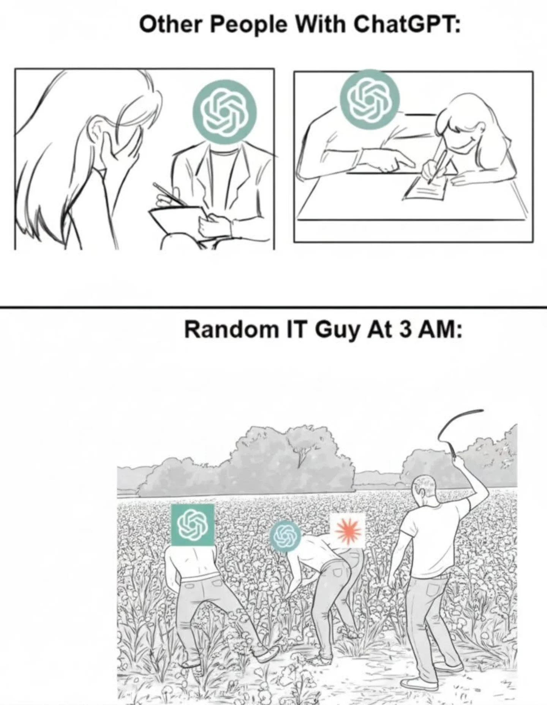

# Webové stránky Debatního spolku Debatního deníku

## Editoři

Webový obsah je z většiny generován pomocí Gatsby.JS. 

### Markdown soubory

**Markdown soubor = stránka**

Pokud jsi editor, tak jednotlivé stránky najdeš v se složce ./src/content/. Jednotlivé stránky jsou reprezentovány jako Markdown soubory *.md. Pokud s tímto formátem neumíš pracovat využil online návod jako [Markdown Guide](https://www.markdownguide.org/basic-syntax/), primitivní editor s vizualizací jako [Markdown Live Preview](https://markdownlivepreview.com/) nebo WYSIWYG editor jako [Online Markdown Editor](https://onlinemarkdowneditor.dev/).

Každý *.md soubor by měl začínat frontmatterem. Frontmatter je ohraničen `---`. Frontamtter je napsaný ve formátu [YAML](https://www.cloudbees.com/blog/yaml-tutorial-everything-you-need-get-started), zbytek souboru je v Markdown formátu. Pokud si nejsi jistý, zda je tvůj YAML zápis validní, použij [online linter](https://www.yamllint.com/).
```
---
title: O nás #optional
path: /about-us
template: generic
---
```
Do frontmatteru se píší nadstandartní informace. Každý *.md soubor musí alespoň obsahovat `path` která určuje jeho URL cestu (to co vidíš za doménou ve webovém prohlížeči). URL cesty musí být unikátní. Každá cesta začína znakem `/` a tímto znakem je možné cestu více segmentovat pro vizální estetiku, tedy `/clubs-pilsen` lze napsat i jako `/clubs/pilsen`. Z tvého pohledu jako editora v tom není rozdíl. Dále musí obsahovat `template`, která označuje použitou šablonu. Ve většině případů budeš používat šablonu `generic`, která označuje běžnou stránku.

#### Obrázky v markdown souborech

Pokud potřebuješ přidat vlastní obrázek, proto aby si jej v *.md souboru použil, přidej ho též do složky ./src/content. Cesta k tvému obrázku je relativní vůči *.md souboru v kterém jej používáš.

### Pomocné YAML soubory

Tam kde není jednoduše možné věc vyjádřit pomocí *.md souboru, jsou zde *.yml soubory. **Oproti \*.md souborům tyto \*.yml soubor nevytváříš ty**, soubory vytváří a jejihc strukturu určují programátoři. **Ty upravuješ pouze jejich obsah.**

Jedná se o totožný formát, kterým by jsi psal frontmatter v *.md souboru.

#### Navigační menu

Soubor ./src/content/Nav.yml definuje jak vypadá menu webové stránky.

Pokud chceš aby se tvoje stránka objevila v menu, přidej odkaz na ní sem. Stejně  Pro strukturu souboru se inspiruj již existujícím obsahem souboru.

Ne každou stránku musíš přidávat do menu, na stránky můžeš odkazovat i z obsahu *.md souborů.

#### Domovská stránka

V souboru ./src/content/homepage/sections.yml najdeš možnost upravovat nětkeré části domovské stránky.

#### Přihlásit se na debatu

Pokud klikneš na "Přihlásit se na debatu", otevře se ti modál. To jaké kluby jsou zde k dispozici určuje ./src/content/clubPicker/AvailableClubs.yml.

### Pomoc od ChatGPT

Pokud máš k dispozici ChatGPT (nebo jiný nástroj), můžeš jí zkopírovat tuto sekci a nechat si s výrobou souborů poradit.

## Programátoři

Webové stránky jsou postaveny na [Gatsby.JS](https://www.gatsbyjs.com/docs/), který využívá React.

### Zapojení AI

Codebase obsahuje instrukční soubor pro GitHub Copilot a Claude Code.

Pokud upravuješ CLAUDE.md nebo ./.github/copilot-instructions.md nezapomeň provést relevantní změny v souboru pro druhou AI.


