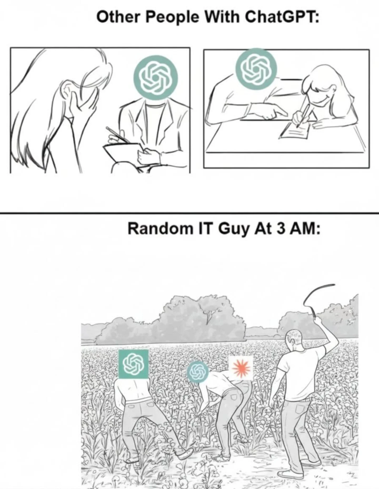

# Webové stránky Debatního spolku Debatního deníku

## Přidávání změn 

Bez ohledu na to zda, jsi editor nebo programátor, změny se v tomto repozitáři dělají skrze [pull requesty](https://docs.github.com/en/pull-requests/collaborating-with-pull-requests/proposing-changes-to-your-work-with-pull-requests/about-pull-requests).

Pokud edituješ soubory přímo skrze webovku GitHubu, bude ti při uložení změny zvol `Create a new branch for this commit and start a pull request`, čímž ti bude založena nová větev a otevře se ti okno pro založení **pull requestu**. __Tento postup je vhodný zejména pokud si editor.__

### Automatciký náhled

Jakmile vytvoříš tvůj pull request, přibližně do 5ti minut ti naše [GitHub workflow](https://docs.github.com/en/actions/concepts/workflows-and-actions/workflows) přidá komentář s odkazem, kde si můžeš svoje změny prohlédnout.

Příklad takového komentáře:
```
Azure Static Web Apps: Your stage site is ready! Visit it here: https://delightful-hill-0f8fc9f03-3.westeurope.6.azurestaticapps.net
```

## Editoři

Webový obsah je z většiny generován pomocí Gatsby.JS. 

### Markdown soubory

**Markdown soubor = stránka**

Pokud jsi editor, tak jednotlivé stránky najdeš v se složce ./src/content/. Jednotlivé stránky jsou reprezentovány jako Markdown soubory *.md. Pokud s tímto formátem neumíš pracovat využil online návod jako [Markdown Guide](https://www.markdownguide.org/basic-syntax/), primitivní editor s vizualizací jako [Markdown Live Preview](https://markdownlivepreview.com/) nebo WYSIWYG editor jako [Online Markdown Editor](https://onlinemarkdowneditor.dev/).

Každý *.md soubor by měl začínat frontmatterem. Frontmatter je ohraničen `---`. Frontamtter je napsaný ve formátu [YAML](https://www.cloudbees.com/blog/yaml-tutorial-everything-you-need-get-started), zbytek souboru je v Markdown formátu. Pokud si nejsi jistý, zda je tvůj YAML zápis validní, použij [online linter](https://www.yamllint.com/).
```
---
title: O nás #optional
path: /about-us
template: generic
---
```
Do frontmatteru se píší nadstandartní informace. Každý *.md soubor musí alespoň obsahovat `path` která určuje jeho URL cestu (to co vidíš za doménou ve webovém prohlížeči). URL cesty musí být unikátní. Každá cesta začína znakem `/` a tímto znakem je možné cestu více segmentovat pro vizální estetiku, tedy `/clubs-pilsen` lze napsat i jako `/clubs/pilsen`. Z tvého pohledu jako editora v tom není rozdíl. Dále musí obsahovat `template`, která označuje použitou šablonu. Ve většině případů budeš používat šablonu `generic`, která označuje běžnou stránku.

#### Obrázky v markdown souborech

Pokud potřebuješ přidat vlastní obrázek, proto aby si jej v *.md souboru použil, přidej ho též do složky ./src/content. Cesta k tvému obrázku je relativní vůči *.md souboru v kterém jej používáš.

### Pomocné YAML soubory

Tam kde není jednoduše možné věc vyjádřit pomocí *.md souboru, jsou zde *.yml soubory. **Oproti \*.md souborům tyto \*.yml soubor nevytváříš ty**, soubory vytváří a jejihc strukturu určují programátoři. **Ty upravuješ pouze jejich obsah.**

Jedná se o totožný formát, kterým by jsi psal frontmatter v *.md souboru.

#### Navigační menu

Soubor ./src/content/Nav.yml definuje jak vypadá menu webové stránky.

Pokud chceš aby se tvoje stránka objevila v menu, přidej odkaz na ní sem. Stejně  Pro strukturu souboru se inspiruj již existujícím obsahem souboru.

Ne každou stránku musíš přidávat do menu, na stránky můžeš odkazovat i z obsahu *.md souborů.

#### Domovská stránka

V souboru ./src/content/homepage/sections.yml najdeš možnost upravovat nětkeré části domovské stránky.

#### Přihlásit se na debatu

Pokud klikneš na "Přihlásit se na debatu", otevře se ti modál. To jaké kluby jsou zde k dispozici určuje ./src/content/clubPicker/AvailableClubs.yml.

### Pomoc od ChatGPT

Pokud máš k dispozici ChatGPT (nebo jiný nástroj), můžeš jí zkopírovat tuto sekci a nechat si s výrobou souborů poradit.

## Programátoři

Webové stránky jsou postaveny na [Gatsby.JS](https://www.gatsbyjs.com/docs/), který využívá React.

### Zapojení AI

Codebase obsahuje instrukční soubor pro GitHub Copilot a Claude Code.

Pokud upravuješ CLAUDE.md nebo ./.github/copilot-instructions.md nezapomeň provést relevantní změny v souboru pro druhou AI.

## Kalendář akcí (/akce) a integrace Google Calendar

Stránka `/akce` zobrazuje nejbližší debaty a interaktivní měsíční kalendář přímo z veřejného Google Kalendáře pomocí Google Calendar API v3 (bez nutnosti OAuth a bez backendové databáze).

### Jak celý kalendář funguje (pro organizátory a editory)

1. **Jednoduchá správa přes Google Kalendář:**
   * Organizátor nebo editor otevře Google Kalendář spolku (*Debatní spolek debatního deníku – Akce*).
   * Vytvoří nebo upraví událost (zadá název, datum a čas, případně místo a stručný popis).
   * **Není potřeba nic programovat, commitovat ani nasazovat nový build webu.**
   * Jakmile návštěvník otevře stránku `/akce`, web si přes veřejné Google Calendar API události přímo načte. Změny v kalendáři se tak na webu projeví okamžitě.

2. **Co všechno web s událostmi automaticky dělá:**
   * **Seznam nejbližších akcí (levý sloupec):**
     * Filtruje pouze budoucí události a chronologicky zobrazuje nejbližších 5 akcí.
     * U každé akce zobrazí přehlednou kartu s datem, časem, místem, popisem a odkazem.
     * Pokud nejsou naplánovány žádné akce, zobrazí příjemný prázdný stav s odkazem na náš Discord.
   * **Vlastní interaktivní měsíční kalendář (pravý sloupec):**
     * Vykreslí měsíční mřížku odpovídající designu webu (žádný vložený iframe).
     * Dny s naplánovanými akcemi automaticky označí barevnou tečkou podle typu akce.
     * Umožňuje přepínat mezi měsíci i vrátit se tlačítkem *Dnes*.
     * Kliknutím na libovolný den se pod kalendářem zobrazí detail všech akcí pro daný den.
   * **Automatické rozpoznání typu akce:**
     * Podle klíčových slov v názvu a popisu automaticky přiřadí barevný odznak a ikonu:
       * **Debata / schůzka:** modrý odznak 💬
       * **Turnaj:** červený odznak 🏆
       * **Workshop / přednáška / školení:** žlutý odznak 💡
       * **Ostatní akce:** neutrální odznak 📅
   * **Chytré české formátování:**
     * Názvy dnů a měsíců jsou v přirozené češtině (např. *Pondělí 5. října 2026*).
     * Správně rozlišuje celodenní akce (*Celý den*) a časové rozmezí (*18:00 – 20:30*).
     * Akcím konaným v nejbližších dnech automaticky přiřadí zelený štítek **Dnes** nebo **Zítra**.
   * **Tlačítko „Přidat do kalendáře“:**
     * U každé jednotlivé akce nabízí možnost:
       1. **Google Kalendář:** otevře webové rozhraní Google Kalendáře s předvyplněným konkrétním názvem, datem a časem, místem i popisem události.
       2. **Apple / Outlook (.ics):** vygeneruje a stáhne standardní `.ics` soubor pro otevření v kalendáři na iPhone, Macu, Windows či Outlooku.
   * **Ochrana proti nákladům a limitům:**
     * Žádný polling ani cyklické dotazování na pozadí.
     * Při načtení stránky se provede pouze 1 optimalizovaný požadavek, který načte 3měsíční období a uloží jej do klientské cache.
     * Procházení již načtených měsíců v kalendáři neposílá žádné další síťové požadavky (0 requestů).
     * V případě chyby API (např. 403, 429) se aktivuje ochrana (circuit breaker), která zabrání dalším zbytečným requestům a zobrazí uživateli čistou chybovou hlášku s možností jednoho ručního opakování.

---

### Technické nastavení a konfigurace (9 kroků)

### 1. Vytvoření Google Cloud projektu
1. Přejděte do [Google Cloud Console](https://console.cloud.google.com/).
2. V horní liště klikněte na výběr projektů a zvolte **New Project** (Nový projekt).
3. Pojmenujte projekt (např. `Debatni-Spolek-Web`) a klikněte na **Create**.

### 2. Zapnutí Google Calendar API
1. V levém navigačním menu otevřete **APIs & Services** > **Library** (Knihovna rozhraní API).
2. Vyhledejte **Google Calendar API**.
3. Otevřete detail a klikněte na modré tlačítko **Enable** (Povolit).

### 3. Vytvoření API klíče
1. V levém menu přejděte do **APIs & Services** > **Credentials** (Přihlašovací údaje).
2. V horní nabídce klikněte na **+ Create Credentials** > **API key**.
3. Vytvořený klíč se zobrazí v dialogu. Zkopírujte si ho.

### 4. Omezení API klíče (DŮLEŽITÉ Z HLEDISKA BEZPEČNOSTI)
Protože Gatsby vkládá proměnné s prefixem `GATSBY_` do klientského JavaScript bundle, API klíč je veřejně čitelný. V Google Cloud Console je proto **nutné** nastavit bezpečnostní restrikce:
1. V seznamu API klíčů klikněte na název právě vytvořeného klíče (nebo ikonu tužky pro úpravu).
2. **API restrictions (Omezení API)**:
   - Zvolte možnost **Restrict key** (Omezit klíč).
   - V rozevíracím seznamu zaškrtněte **pouze** `Google Calendar API`.
3. **Application restrictions (Omezení aplikací)**:
   - Zvolte možnost **Web sites (HTTP referrers)**.
   - Do seznamu povolených refererů přidejte:
     - `https://debatnispolek.debatnidenik.cz/*`
     - `https://*.azurestaticapps.net/*` (pro staging a PR preview nasazení)
     - Pro lokální vývoj můžete dočasně přidat `http://localhost:8000/*` nebo `http://localhost:*/*`.
4. Klikněte na **Save** (Uložit).

### 5. Nastavení veřejného Google Kalendáře
Google Calendar API vyžaduje, aby byl kalendář označen jako veřejný:
1. Otevřete [Google Kalendář](https://calendar.google.com/).
2. V levém sloupci v sekci **Moje kalendáře** najeďte na kalendář spolku, klikněte na **tři tečky** a zvolte **Nastavení a sdílení**.
3. V sekci **Přístupová oprávnění k událostem** zaškrtněte volbu:
   - **Zpřístupnit veřejnosti** (Make available to public)
   - V rozevíracím seznamu zvolte **Zobrazit všechny podrobnosti události** (See all event details).

### 6. Získání Calendar ID
1. Na stejné stránce nastavení kalendáře sjeďte níže do sekce **Integrovat kalendář**.
2. Zkopírujte hodnotu pole **Identifikátor kalendáře** (Calendar ID).
   - Formát vypadá například takto: `c_xxxxxxxxxxxxxxxxxxxxxxxxxx@group.calendar.google.com` nebo vaše e-mailová adresa.

### 7. Vložení hodnot do `.env`
V kořenovém adresáři projektu vytvořte soubor `.env` (nebo `.env.development` / `.env.production`) podle vzoru v `.env.example`:

```env
GATSBY_GOOGLE_CALENDAR_API_KEY=AIzaSy...váš_omezený_klíč
GATSBY_GOOGLE_CALENDAR_ID=c_xxxxxxxx@group.calendar.google.com
```

> **Upozornění:** Soubor `.env` je zařazen v `.gitignore` a nikdy se nesmí commitovat do repozitáře.

### 8. Spuštění Gatsby projektu
Pro spuštění lokálního vývojového serveru:
```bash
npm run develop
# nebo
npm start
```
Web bude dostupný na `http://localhost:8000/akce`.

### 9. Build a Deploy
Před nasazením můžete ověřit typovou kontrolu a provést produkční build:
```bash
npm run typecheck
npm run build
```

#### Nasazení na Azure Static Web Apps:
V Azure portálu nebo v nastavení GitHub Actions přidejte proměnné prostředí:
- `GATSBY_GOOGLE_CALENDAR_API_KEY`
- `GATSBY_GOOGLE_CALENDAR_ID`

Tyto proměnné budou během buildu automaticky vloženy do statického bundle.

